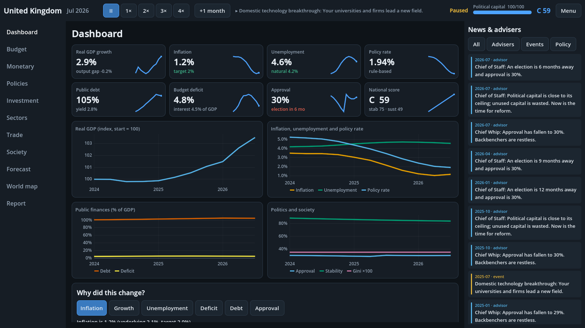

# Economic Management Game

Pick a country and run its economy: tax, budget, interest-rate stance, trade and industrial policy, public investment, politics and shocks, on a navigable 2D map or 3D globe. Desktop game built with **Godot 4.3 (.NET)** on a deterministic, headless **C# simulation core**.



## Quick start

```bash
# simulation only (no engine needed)
dotnet test EconGame.sln                                   # 122 unit/property/regression tests
dotnet run --project src/Sim.Cli -- run --country GBR --years 30
dotnet run --project src/Sim.Cli -- smoke --years 30       # 28 countries, stability check
dotnet run --project src/Sim.Cli -- balance --years 15     # scripted-strategy self-play balance report

# the game: tools/run.sh (or tools/run.ps1 on Windows), or open game/ in Godot 4.3 (.NET build) and press F5, or
dotnet build game/EconomicGame.csproj && godot --path game
```

Full install and test-run steps: [docs/PLAY.md](docs/PLAY.md). How the systems fit together: [docs/SYSTEMS.md](docs/SYSTEMS.md).

Headless screenshots of every screen (needs Godot + Xvfb): `tools/shots.sh /tmp/shots` (set `RES=1600x900` for a normal-aspect run).

## What is in the box

| Area | Contents |
|---|---|
| **28 countries** | Hand-curated 2023/24 starting data across advanced, emerging, resource, hub and developing economies (`data/countries.json`, built by `tools/data_import/`) |
| **Macro engine** | National accounts, six-sector input-output economy, Cobb-Douglas supply with human capital, TFP and public-asset effects, IS-style demand, Phillips curve with expectations and credibility, Taylor-rule central bank, fiscal and debt dynamics with sovereign spreads, exchange rate, demography, inequality, approval, emissions and climate |
| **Decisions** | 10 budget lines, 5 taxes, policy rate or rule, FX regime, 40 policies (legislative votes, delays, mutually exclusive groups), 15 multi-year projects with overruns, sector subsidies, carbon price, advisers who disagree, fan-chart forecasts and what-if previews |
| **World** | Gravity-model trade, contagion, USD anchor, commodity cycles, AI governments with distinct styles and reform agendas, trade deals, tariffs and retaliation, sanctions, aid, alliances, climate club |
| **Politics & events** | 22 data-driven events and crises, decision popups, IMF programmes, defaults, elections, coups |
| **Scoring** | Five-component scorecard, "why did this change?" attribution, 11 tutorial/historical/challenge scenarios, difficulty levels |
| **Map** | Natural Earth world map with overlays, trade-flow arcs, event pins, bookmarks, search, minimap, illustrative regional drill-down for nine federations, and a rotatable 3D globe |

## Repository layout

```
src/Sim.Core    deterministic simulation library (no engine dependency)
src/Sim.Tests   xUnit tests: calibration invariants, identities, impulse responses, determinism, balance
src/Sim.Cli     headless runner, smoke test and balance harness
game/           Godot project (code-built UI under scripts/, map data under data/)
data/           countries, policies, events, scenarios, regions (JSON, embedded in Sim.Core)
tools/          data generators (Python), map preparation, screenshot harness
docs/           design, model equations, data sources, roadmap
```

## Design rules

* All player actions are serialisable `Command`s applied at tick boundaries, so a game is replayable from seed + command log.
* The simulation is deterministic for a seed (including events) and bounded by regime guards; `smoke`, the test suite and the nightly balance job enforce no NaNs, runaways or dominant strategies.
* Data are approximations for gameplay, not forecasts. See [docs/DATA.md](docs/DATA.md).

See [docs/ROADMAP.md](docs/ROADMAP.md) for the staged plan and status, [docs/MODEL.md](docs/MODEL.md) for the equations and [CHANGELOG.md](CHANGELOG.md).
